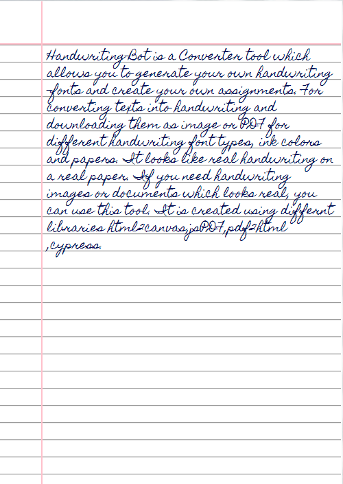

 
 <b><a href="https://ayushnamdeo02.github.io/handwriting-bot/">https://ayushnamdeo02.github.io/handwriting-bot/</a></b>  
  

It is a handwriting-bot tool that converts text to an image that looks like handwriting and it helps you to do easy assinments

*Note: Always use the latest updated code*

## Output

## to Contribue

1) clone the repostory to local.
2) update the code.
3) create a new branch and push your updated code.

## Libraries used

- html2canvas - Turns DOM into Canvas.
- jsPDF- To generate PDF from images.
- cypress- Testing Library

---

 &nbsp; 

Thanks for visting
